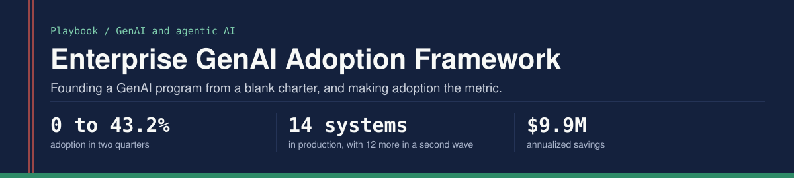
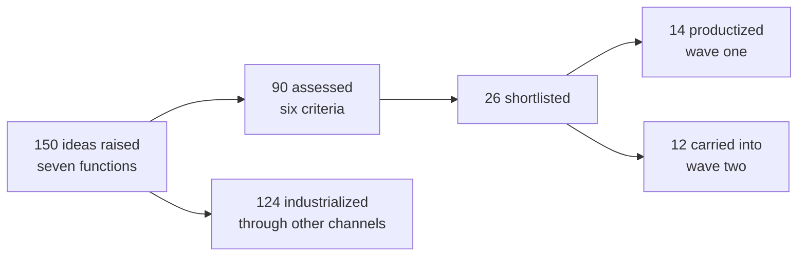

How to found a GenAI and agentic AI program inside a large operations organization, and make adoption the metric instead of deployment.

Built from founding Amazon Seller Protection's first GenAI and Agentic AI program from a blank charter, with no team and no budget.

## Results

| Metric | Result |
|---|---|
| Adoption (weekly active use, out of all 2,500 investigators) | 0 to 43.2% in two quarters |
| Systems | 14 systems in production, with 12 more in a second wave |
| Annualized savings from the 14 productized systems | $9.9M |
| Model hallucination | Down 50%, measured against human decisions on real historical cases |
| Handle time | 1 minute cut per contact |
| Program Net Promoter Score | -37.2 to 53 in the first 15 months, 91 in year three |

## The problem this solves

Most large organizations stall between awareness and scale. They run a few demos, a hackathon, maybe one pilot. Then nothing ships, or things ship and nobody uses them.

The gap is rarely model capability. It is missing program infrastructure: no shared intake, no way to score one idea against another, no charter that aligns leadership, no path from prototype to production, and no adoption number that anyone owns.

## 1. Convene before you build

Seven functions fed one intake forum: operations, science, product, legal, policy, translation and tooling. I founded and chaired it. Legal and policy sat in the forum, so compliance shaped the pipeline instead of blocking it at the end.

## 2. A pipeline that sorts, not a funnel that narrows

- 150 ideas raised across the organization
- 90 assessed and 26 shortlisted; 26 was also the engineering capacity for the year
- 14 productized in wave one, 12 carried into wave two
- 124 industrialized through other channels: platform, tooling, policy, translation and chatbot
- None cancelled

An idea that does not need engineering capacity should not wait for it.

## 3. Six scoring criteria

The assessed ideas were scored on six criteria:

| Criterion | Question it answers |
|---|---|
| Contact volume | Is it worth doing? |
| ROI | Is it worth doing? |
| Automation readiness | Is it ready to automate? |
| Error cost | Is it safe to do? |
| Model ability | Is it safe to do? |
| Policy and legal compliance | Is it safe to do? |

Volume and ROI say what is worth doing. Error cost, model ability and compliance say what is safe to do. When a stakeholder pushes a favorite idea, the scores carry the argument.

## 4. The charter

I wrote the VP-approved charter and carved engineering and data-science capacity out of existing teams instead of asking for headcount. In a cost-constrained environment a reallocation is approved far faster than a new investment.

Charter sections:

1. Problem statement: why now, why this organization, the cost of doing nothing
2. Proposed solution: scope, operating model, what done looks like
3. Resource ask: capacity reallocated from existing teams
4. Vision and roadmap: milestones, metrics, decision gates
5. Risk and mitigation: what could go wrong and how you will know early
6. The specific approval being asked for

The build ran across 6 to 10 engineering and data science teams, 10 to 25 engineers and scientists, matrixed through their own managers. I had no authority over their priorities. I wrote the business and product requirement documents myself.

## 5. Adoption as the metric

- **Definition.** Weekly active use, out of all 2,500 investigators: the share actively using the AI tools in their work that week. Tracked alongside it: the share of contacts handled with AI, and the enforcement actions recommended by the deployed agents.
- **Placement.** The tools sat inside the investigator tool people already had open.
- **Champions.** 50 AI champions, one per function in each business line, self-nominated or nominated by their leaders. They surfaced and vetted use cases, built or co-built first versions, ran demos, trained their teams and triaged issues.
- **Listening.** The delivery dashboard was green while users scored the program -37.2. We were measuring what we had shipped, not what they felt. The score reached 53 within 15 months and 91 in year three.

## 6. Guardrails

- **A person decides.** A person approved every enforcement on a seller's account. The AI only recommended.
- **Controlled before autonomous.** For a workflow of more than twenty steps, a constrained, retrieval-grounded path with human validation was chosen first over a more autonomous agentic workflow.
- **Grounding is a shipping condition.** A mandatory grounding gate sits in the definition of done. It is not a later enhancement.
- **Formal acceptance testing.** Named testers, a defined sample of real historical cases, an accuracy target measured against human decisions, written sign-off and a tested rollback path, with exit criteria agreed before build started. Go-live was phased by cohort behind feature flags.
- **A named framework.** The NIST AI Risk Management Framework was the reference (referenced, not certified): Govern is the intake forum with legal and policy; Map is the per-use-case risk view; Measure is testing against human decisions; Manage is the grounding gate and rollback.

## 7. Benefits you can defend

Savings get disputed. Agree the metric definitions, data sources and calculations with every team first, then publish the benefits dashboard. The same rule settled the adoption number.

## Lessons

1. Own the metric nobody else owns. Adoption was an orphaned number; owning it gave the program its mandate.
2. Carve capacity, do not ask for it.
3. Sort ideas, do not cull them. A pipeline that only says no stops receiving ideas.
4. Adoption is a change problem, not a technology problem. Invest in champions, not only launches.
5. Decide what done means before build starts, grounding included.

## What I did and did not do

I wrote the charter, the requirement documents and the prompts, chaired the intake forum, and carried the adoption number. I worked at the architecture, requirements and evaluation layer, and I understand the system at diagram level. Engineering and science teams owned implementation and model infrastructure; I do not write or review application code.

## Author

Prateek Ratnakar. AI transformation and program leader; 12 years, nine of them at Amazon (May 2017 - Jun 2026), as Senior Program Manager in Amazon Seller Protection.

Amazon North Star Award (2025 and 2021) | Business Leader of the Year (2019) | IIT (BHU) Varanasi | IIM Bangalore

[Portfolio](https://prateek-ratnakar.github.io) | [LinkedIn](https://www.linkedin.com/in/prateekratnakar) | [GitHub](https://github.com/prateek-ratnakar)

Every figure here matches my resume, my portfolio and my interview answers. The content is generalized; no proprietary systems, data or code are included.
